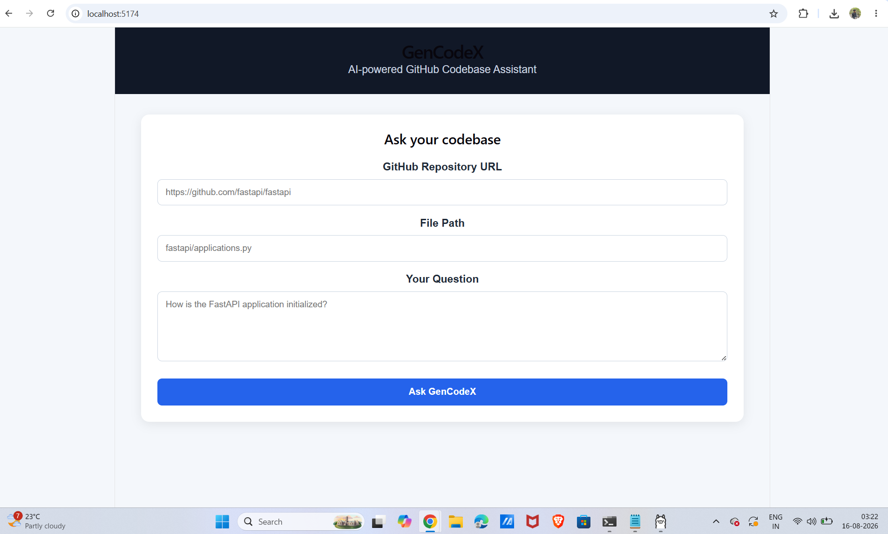
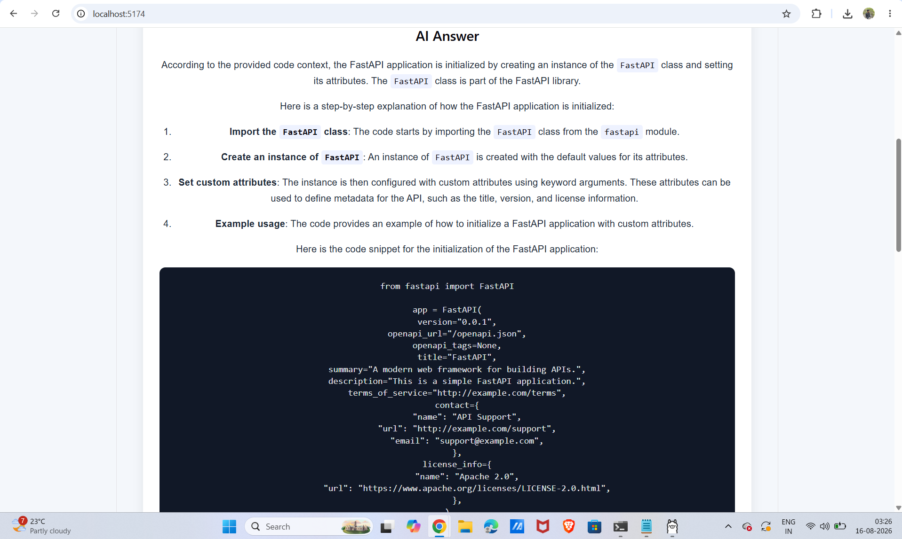
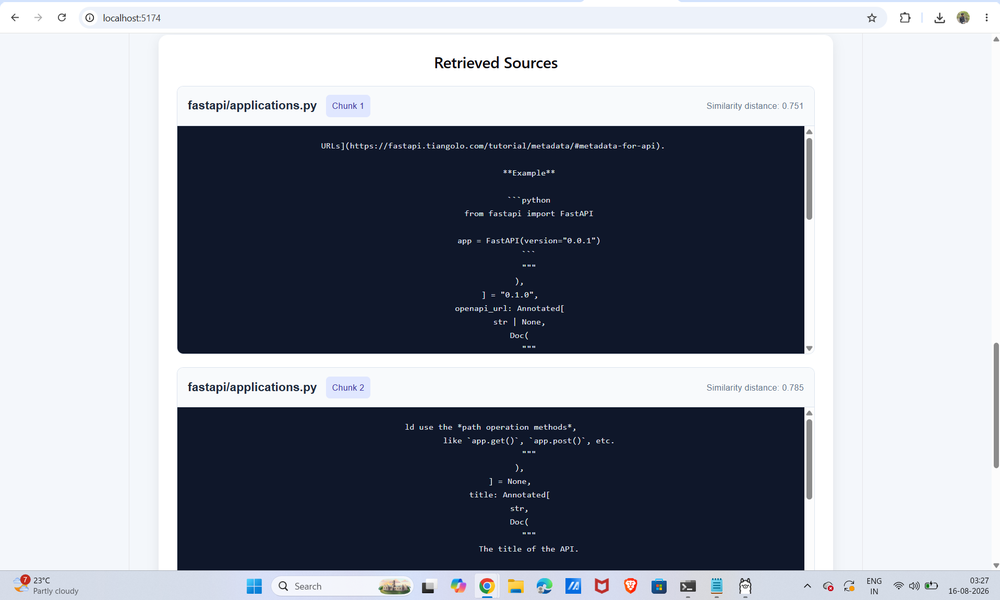
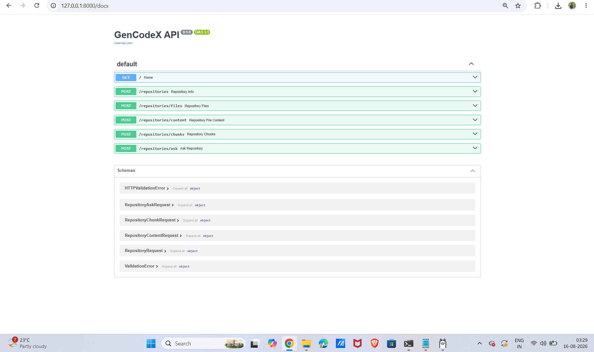

# GenCodeX

## AI-Powered GitHub Codebase Assistant

GenCodeX is an AI-powered GitHub codebase assistant that helps developers understand and explore source code from GitHub repositories.

It uses Retrieval-Augmented Generation (RAG) to retrieve relevant source-code sections using semantic search and provide AI-generated explanations using a locally running Qwen2.5-Coder model through Ollama.

---

## 1. Project Description

GenCodeX allows users to provide a GitHub repository, select a source-code file, and ask questions about the code.

The system retrieves the requested source code, divides it into smaller chunks, generates semantic embeddings, searches for the most relevant chunks using FAISS, and provides the retrieved context to Qwen2.5-Coder for generating an explanation.

The project was built to make understanding unfamiliar GitHub codebases easier by combining semantic code search with a local Large Language Model (LLM).

---

## 2. Key Features

- GitHub source-code retrieval
- Code chunking
- Semantic code embeddings
- FAISS similarity search
- Retrieval-Augmented Generation (RAG)
- Qwen2.5-Coder 3B
- Ollama local LLM inference
- AI-powered code explanation
- Retrieved source-code display
- React-based user interface
- FastAPI backend
- Markdown-formatted AI responses
- API error handling
- Frontend-to-backend communication

---

## 3. System Architecture

```text
                         GenCodeX
                            |
                            v
                  React + Vite Frontend
                            |
                            v
                     FastAPI Backend
                            |
                 +----------+----------+
                 |                     |
                 v                     v
           GitHub Service       Code Processing
                                       |
                                       v
                                 Code Chunking
                                       |
                                       v
                                  Embeddings
                                       |
                                       v
                                  FAISS Search
                                       |
                                       v
                              Relevant Code Context
                                       |
                                       v
                              Ollama / Qwen2.5
                                       |
                                       v
                              Generated Answer
                                       |
                                       v
                              React Frontend

4. Technology Stack
Programming Languages
Python
JavaScript
Frontend
React
Vite
CSS
React Markdown
Backend
FastAPI
Pydantic
PyGithub
AI and RAG
Sentence Transformers
FAISS
Ollama
Qwen2.5-Coder 3B
Development Tools
Git
GitHub
npm
Python Virtual Environment
5. Project Structure
GenCodeX/
│
├── backend/
│   └── app/
│       ├── main.py
│       ├── github_service.py
│       ├── chunking_service.py
│       ├── embedding_service.py
│       ├── vector_store.py
│       ├── code_search_service.py
│       ├── llm_service.py
│       │
│       ├── test_chunking.py
│       ├── test_embeddings.py
│       ├── test_faiss.py
│       ├── test_code_search.py
│       └── test_llm.py
│
├── frontend/
│   ├── public/
│   ├── src/
│   │   ├── App.jsx
│   │   ├── App.css
│   │   ├── index.css
│   │   └── main.jsx
│   ├── package.json
│   ├── package-lock.json
│   └── vite.config.js
│
├── docs/
│   └── screenshots/
│       ├── frontend.png
│       ├── ai-answer.png
│       ├── sources.png
│       └── api-docs.png
│
├── .gitignore
└── README.md
Backend File Responsibilities
File	Responsibility
main.py	FastAPI application and API endpoints
github_service.py	GitHub repository and source-code retrieval
chunking_service.py	Splits source code into smaller chunks
embedding_service.py	Generates semantic embeddings
vector_store.py	Handles FAISS vector storage and search
code_search_service.py	Performs semantic code retrieval
llm_service.py	Connects GenCodeX to the local Qwen model through Ollama
6. How It Works

GenCodeX follows a Retrieval-Augmented Generation pipeline.

Step 1: User Input

The user provides:

GitHub repository URL
Source-code file path
Question about the code
Step 2: GitHub Code Retrieval

The FastAPI backend connects to GitHub and retrieves the requested source file.

Step 3: Code Chunking

The source code is divided into smaller chunks so that relevant sections can be retrieved efficiently.

Step 4: Embedding Generation

The code chunks are converted into numerical vectors using Sentence Transformers.

These embeddings represent the semantic meaning of the source-code chunks.

Step 5: FAISS Similarity Search

The user's question is converted into an embedding and compared against the code embeddings.

FAISS retrieves the most relevant code chunks based on semantic similarity.

Step 6: Context Construction

The retrieved code chunks are combined to create the context provided to the language model.

Step 7: AI Generation

Qwen2.5-Coder 3B, running locally through Ollama, receives the user's question and the retrieved code context.

The model generates an explanation based on the provided code context.

Step 8: Final Response

The generated explanation is returned to the React frontend along with the retrieved source-code chunks.

7. Installation & Setup
Prerequisites

Install the following:

Python
Node.js
Git
Ollama
Clone the Repository
git clone https://github.com/korivisathvik55/GenCodeX.git
cd GenCodeX
Backend Setup

Create a Python virtual environment:

python -m venv .venv

Activate the environment:

.venv\Scripts\activate

Install the required Python packages:

pip install -r requirements.txt
Ollama Setup

Download the Qwen2.5-Coder model:

ollama pull qwen2.5-coder:3b

Test the model:

ollama run qwen2.5-coder:3b
Start the Backend

From the project root:

uvicorn backend.app.main:app --reload

Backend URL:

http://127.0.0.1:8000

FastAPI documentation:

http://127.0.0.1:8000/docs
Start the Frontend

Open another terminal:

cd frontend
npm.cmd install
npm.cmd run dev

Frontend URL:

http://localhost:5173

Vite may automatically use another available port if port 5173 is already occupied.

8. API Documentation
GET /

Checks whether the GenCodeX backend is running.

POST /repositories

Retrieves information about a GitHub repository.

POST /repositories/files

Retrieves files available in a GitHub repository.

POST /repositories/content

Retrieves the contents of a specific source file.

POST /repositories/chunks

Retrieves a source file and divides it into code chunks.

POST /repositories/ask

Runs the complete RAG pipeline:

Question
   |
   v
Code Retrieval
   |
   v
Code Chunking
   |
   v
Embeddings
   |
   v
FAISS Search
   |
   v
Relevant Code Context
   |
   v
Qwen2.5-Coder
   |
   v
AI Answer
9. Example
Repository
https://github.com/fastapi/fastapi
File
fastapi/applications.py
Question
How is the FastAPI application initialized?
GenCodeX Processing
GitHub File
     |
     v
Code Chunks
     |
     v
Embeddings
     |
     v
FAISS Search
     |
     v
Relevant Chunks
     |
     v
Qwen2.5-Coder
     |
     v
AI Explanation


The application also displays the retrieved source-code chunks used as context for the generated answer.

## 10. Screenshots

### GenCodeX Frontend



### AI-Generated Answer



### Retrieved Source Code



### FastAPI Documentation



11. Testing

The following components have been tested individually and as an integrated system:

Code chunking
Embedding generation
FAISS similarity search
Semantic code search
Local LLM generation
GitHub code retrieval
End-to-end RAG API
React frontend
Frontend-to-backend communication
Source-code retrieval and display
End-to-End Test

The complete pipeline was successfully tested using a GitHub repository and a source-code question.

Example:

Repository:
https://github.com/fastapi/fastapi


File:
fastapi/applications.py


Question:
How is the FastAPI application initialized?

The system successfully retrieved relevant code, generated an AI explanation, and displayed the source chunks used during retrieval.

12. Project Status
Core RAG Pipeline: Complete

The current implementation successfully demonstrates:

GitHub
   |
   v
Code Retrieval
   |
   v
Code Chunking
   |
   v
Embeddings
   |
   v
FAISS Similarity Search
   |
   v
Relevant Code Context
   |
   v
Qwen2.5-Coder + Ollama
   |
   v
AI-Generated Explanation
   |
   v
React Interface
13. Future Enhancements

Possible future improvements include:

Repository-wide indexing
Automatic file selection
Multi-file code analysis
Conversation history
Code navigation
Improved code-aware chunking
Private GitHub repository support
Automated test coverage
Cloud deployment
Advanced repository analysis
14. Author

Korivi Sathvik

GitHub:

https://github.com/korivisathvik55